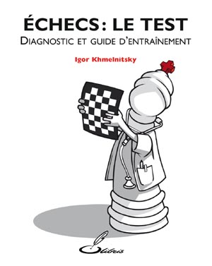
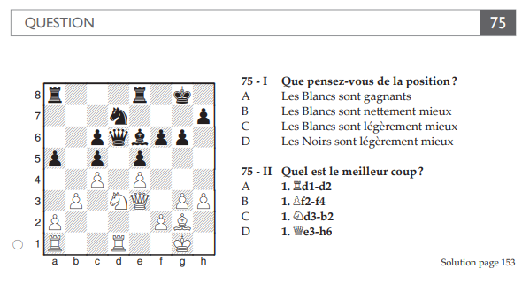

# Chess-test

## Reference

This repository implements as an app the chess test described in the book [Echecs : le test, Diagnostic et guide d'entraînement](https://olibris.fr/entrainement/28-echecs-le-test-9782916340081.html) by Igor Khmelnitsky.

## How to use

Launch the app with `python3 chess_test.py` and answer the questions. You will be presented with 100 chess positions with 2 questions each (200 questions in total). The questions are of the following type:

At the end of the test, your estimated rating will be displayed. A global one and one for each of the 12 categories (opening, middlegame, endgame, tactics, etc.).
